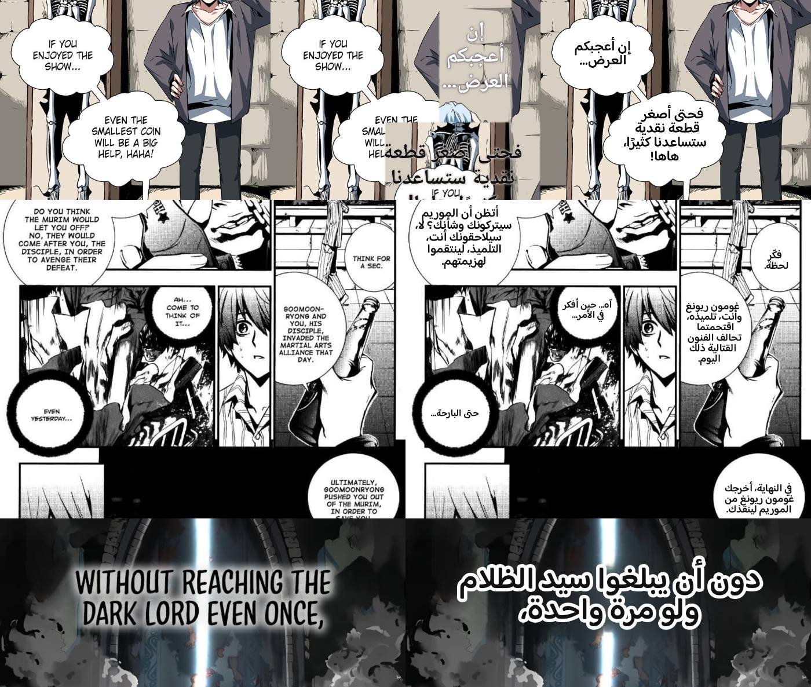

# الترجمة المرئية — الخط المعالجي وقياسه

> **الحالة:** مُقاس على 11 صفحة حقيقية من قارئ VANTARA (لقطات جهاز مشعل)، وهي
> اختبارات انحدار إلزامية في `services/translation-worker/tests/test_regression_pages.py`.
> لا صفحة اصطناعية في القياس.



الصف الأول: الأصل، ثم ما كان النظام القديم يفعله (يلصق رقعةً من الرسم فوق
الشخصية ويُبقي الإنجليزي)، ثم الخط الجديد. الصف الثاني صفحة كثيفة (16 فقاعة)،
والثالث نص أبيض بحدّ أسود فوق شعاع ضوء.

---

## 1. لماذا كان القديم كارثيًا

النظام القديم طلب من نموذج اللغة (Luna) **إحداثيات** الفقاعات، ثم حاول الجوال
تصحيحها بقواعد يدوية (`snapBox`، `cleanText`، ترميم بالرقع). ثلاث نتائج مقاسة
على الصفحات الحقيقية:

| العطل | السبب |
|---|---|
| رقعة من الرسم (قبعة، وجه) تُلصق فوق الشخصية | الترميم بالرقع ينسخ من الجوار حين ينزاح الصندوق |
| الإنجليزي يبقى ظاهرًا تحت العربي | صندوق النموذج منزاح عن الحروف فمُسح مكانٌ آخر |
| عربي ضخم فوق الرسم بلا خلفية | لا قناع فقاعة أصلًا؛ الصندوق تقريبي |

القرار: **نموذج اللغة لا يلمس البكسلات.** الهندسة كلها من نماذج رؤية مدرَّبة
على المانجا؛ Luna تستلم نصوصًا بمعرّفات وتردّ بنصوص بمعرّفات.

---

## 2. الخط

```
صفحة
 → RT-DETR-v2 (ogkalu)          صناديق: فقاعة / نص داخل فقاعة / نص فوق الرسم     0.3 ث
 → comic-text-detector (dmMaze) قناع الحروف بكسلًا بكسلًا + خرائط الأسطر         ~10 ث CPU
 → YOLOv8m-seg (kitsumed)       مضلّع الفقاعة بكسلًا بكسلًا                       0.9 ث
 → regions.assemble             منطقة = صندوق نص + فقاعته + حروفها؛ معرّف ثابت من موضعه
 → PP-OCRv5 en (سطرًا سطرًا) / manga-ocr (ياباني)                                0.1 ث
 → Luna (sync-worker /v1/translate/text)   تصحيح القراءة + عربي + تصنيف بالمعرّف
 → layout.fit_in_mask           التفاف مقيَّد بوتر الفقاعة عند كل سطر، تمركز، أكبر حجم يدخل
 → clean.plan_erase             فقاعة مسطّحة: ملء بلونها الدقيق داخل الحدّ؛ فوق رسم: LaMa-manga
 → Pillow/RAQM + Baloo Bhaijaan 2   الرسم
 → تحقق                          لا بكسل تغيّر خارج (قناع المسح ∪ حدود العربي)
```

**القاعدة الصلبة** (مُختبرة): منطقة لا نثق بها تبقى كما هي. بلا عربي لا
تبييض، وبلا تبييض لا عربي. تحديدًا:

| الحالة | القرار |
|---|---|
| ثقة الكشف < 0.35 أو أقل من 40 بكسل حروف | لا منطقة |
| OCR فارغ أو ثقته < 0.55 | `skipped:unreadable` — تُترك |
| Luna قالت `sfx` أو `credit` أو لم تردّ على المعرّف | تُترك (المؤثرات: BOOM، CLANG، 쾅 — الرسم يحتفظ بها) |
| العربي لا يدخل بحجم ≥ 12px | `skipped:no_fit` — تُترك ولا يُمسح أصلها |
| «فقاعة» بلا حروف (فراغات مؤثر كوري ضخم) | تُهمل |

---

## 3. القياس — المرشحون على الصفحات الحقيقية (2026‑09‑24، CPU 4 أنوية)

### كشف الفقاعات وصناديق النص

| المرشح | الرخصة | الزمن/صفحة | النتيجة على 11 صفحة |
|---|---|---|---|
| **RT-DETR-v2 int8** (`ogkalu/comic-text-and-bubble-detector`) | Apache-2.0 | 0.3 ث | كل الفقاعات وصناديق الحوار (0/56 فائتة)؛ المؤثرات `text_free` بثقة 0.37–0.46 (مفيد للتمييز)؛ فقاعات زائفة داخل المؤثر الكوري بثقة 0.36–0.53 (تُرشَّح لخلوّها من حروف) |
| RT-DETR-v2 كامل (168MB) | Apache-2.0 | 1.3 ث | نفس النتيجة؛ لا مبرر للحجم |
| صناديق comic-text-detector (YOLOv5) | GPL-3.0 | ضمن الـ10 ث | تفوته أجزاء من الفقاعات المزدحمة (WILL BE A BIG…) |

**المختار:** RT-DETR-v2 int8، بشرائح رأسية بنسبة ≤ 2.2 للويبتون.

### قناع الحروف

| المرشح | النتيجة |
|---|---|
| **comic-text-detector `seg`** (UNet) عبر OpenCV DNN | ضيّق على الحروف داخل الفقاعات؛ يلتقط الأبيض فوق المطر والدخان والأسود؛ بقع زائفة على النقوش (رمل) — لذلك يُقصّ دائمًا داخل صندوق RT-DETR ثم يُنقّى بعتبة Otsu بقطبية الحبر (طريقة manga-image-translator) |
| نفس النموذج عبر onnxruntime | **35 ث/شريحة** (ORT 1.30، 4 أنوية AVX‑512). بلا رأسي blk/det (`tools/ctd_seg_only.py`، خرج `seg` مطابق بتًّا): **18.7 ث**، منها ConvTranspose 73%. تحويل ConvTranspose إلى Conv×4 + DepthToSpace لا يسرّع (Conv نفسه بطيء هنا: 29 ث)، ولا أي مستوى تحسين أو عدد خيوط. OpenCV DNN يجري النموذج كاملًا في 3.4 ث على الجهاز نفسه — المرشح التالي للجوال إن أثبت سجل الأداء على الهاتف أن `glyphs` هو الأثقل |
| مكوّنات متصلة فقط (comic-translate) | يكفي في الفقاعات المسطّحة، ويفشل فوق الرسم |

### مضلّع الفقاعة

| المرشح | النتيجة |
|---|---|
| **YOLOv8m-seg** (`kitsumed/yolov8m_seg-speech-bubble`) | 100% من فقاعات الكلام والتفكير بما فيها الملتصقتان؛ لا فقاعة على نص السرد فوق الرسم (صحيح) |
| تعبئة من صندوق RT-DETR (`flat_box_mask`) | احتياط لصناديق السرد المستطيلة التي فاتت YOLO (2 من 4 في صفحة واحدة) |
| SAM/SAM2 | لم يُدخل: القناعان أعلاه كفيا، وSAM يحتاج نقاط بذر ووزن 2.5GB |

### التبييض

| المرشح | النتيجة |
|---|---|
| ملء مسطّح بلون الفقاعة داخل الحدّ المتآكل | صفر أثر في كل الفقاعات المسطّحة؛ التوهج الرمادي خلف الحروف يُمسح لأنه «يخالف لون الفقاعة قرب النص» |
| **LaMa-manga ONNX** (`ogkalu/lama-manga-onnx-dynamic`) | المطر يستمر والدخان يلتئم والشعاع يعود خلف النص؛ 1–3 ث للمنطقة |
| OpenCV Telea | بقع ضبابية؛ للمقارنة فقط |

### OCR

| المرشح | النتيجة |
|---|---|
| **PP-OCRv5 en mobile** ONNX سطرًا سطرًا (الأسطر من إسقاط قناع الحروف) | 44 من 45 فقاعة إنجليزية قُرئت حرفيًا بثقة ≥ 0.93، في 0.05–0.1 ث/صفحة |
| manga-ocr ONNX int8 | للياباني (يفهم العمودي)؛ يُفعَّل بـ`VANTARA_JAPANESE=1` |
| PaddleOCR الحزمة الكاملة | لم تُدخل: تجرّ paddlepaddle وتُقفل نسخة Pillow؛ الـONNX يكفي |

### الرسم العربي

`Baloo Bhaijaan 2` (OFL، مصمَّم للعربية، مستدير سميك كخطوط الكوميك) عبر
Pillow/RAQM. حجم الخط يتبع ارتفاع الحرف الأصلي (حتى ×2 داخل الفقاعة لأن
العربي بلا حروف كبيرة). فوق الرسم: بلون الحبر الأصلي مع حدّ مضاد.

---

## 4. ما يثبته الاختبار على كل صفحة

`tests/test_regression_pages.py` — 11 صفحة × 6 قواعد:

1. كل فقاعة حوار حقيقية تُكتشف وتُترجم (بمترجم ثابت) ولها تخطيط عربي.
2. في الفقاعة المسطّحة لا يبقى حبر حيث كانت الحروف (خارج العربي).
3. حلقة على حدّ كل فقاعة لا يتغير فيها بكسل.
4. المؤثرات الصوتية والرسم لا تُمس بايتًا بايتًا (CLANG، STEP، CHIIK، 쾅).
5. لا بكسل يتغير خارج قناع المسح وحدود العربي.
6. كل سطر عربي داخل مضلّع فقاعته.

زائد: بلا مترجم تعود الصفحة بايتًا بايتًا؛ المعرّفات ثابتة عبر التشغيلات.

---

## 5. التشغيل

```bash
cd services/translation-worker
pip install -r requirements.txt
python -m vantara_worker.cli models                         # ~430MB مرة واحدة
python -m vantara_worker.cli translate page.jpg --out out --debug --translator openai
VANTARA_SYNC_URL=https://sync.… python -m vantara_worker.cli serve --port 8765
```

خادم المحتوى: `TRANSLATION_WORKER_URL=http://127.0.0.1:8765`. الجوال يرسل
الصفحة إلى `POST /v1/translate/page` ويستلم الصفحة المترجمة صورةً، ويبدّل
`` بها (ولا يرسم شيئًا).

**العرض التشخيصي:** `--debug` (أو `"debug": true` في الطلب) يعطي صورة فيها
قناع الحروف (أحمر)، مضلّع الفقاعة (أخضر)، قناع المسح (أزرق)، صندوق السرد
المشتق (أصفر)، حدود العربي (سماوي)، ولكل منطقة معرّفها ونوعها وثقة الكشف
وOCR وحالتها ونصّها الأصلي والعربي.

---

## 6. التكميم — قِيس ورُفض

قرار المالك: يُصغَّر النموذج فقط إن لم يتغير الناتج إطلاقًا. القياس على الصفحات الـ11
(`scratchpad/bench/quantize.py`):

| النموذج | الطريقة | الحجم | الناتج مقابل الأصل | القرار |
|---|---|---|---|---|
| YOLOv8m-seg | int8 ثابت (QDQ، معايرة على الصفحات) | 109 → ~28MB | **انهار**: صفر مرشح في 8 من 11 صفحة (IoU 0.27) | مرفوض |
| LaMa-manga | fp16 | 206 → ~103MB | **لا يُحمَّل**: تعارض أنواع في Cast داخل FFT | مرفوض |
| comic-text-detector | fp16 | 95 → 47MB | قناع الحروف يختلف في 0.03–0.12% من البكسلات (IoU 0.9988–0.9997) | مرفوض: ليس مطابقًا |
| RT-DETR-v2 | int8 (من المصدر) | 11MB | هو المقيس أصلًا | معتمد |

النتيجة: الأوزان كما هي (~430MB تنزيل مرة واحدة).

## 7. على الجوال

الخط نفسه منقول إلى Kotlin داخل التطبيق (`android/app/src/main/kotlin/com/vantara/plugins/translation/`)
بـONNX Runtime (arm64): الرؤية والتبييض والرسم على الجهاز، وLuna عبر sync-worker.
النماذج ليست في الـAPK: تُنزَّل من الإعدادات > الترجمة ببصمة sha256 (`ModelStore.kt`
يحمل السجل نفسه). الرسم العربي بـ`Paint`/`Canvas` أندرويد (تشكيل النظام) بالخط المرفق.
العامل Python يبقى مرجع القياس واختبارات الانحدار، وخيار الخادم للويب.

## 8. Luna بجودة فريق — كيف تتعلم

الهندسة من نماذج الرؤية؛ اللغة كلها من Luna. ثلاث طبقات تجعلها تترجم كفريق لا كآلة:

1. **تعليمات ثابتة + بنك أمثلة** (`TEXT_SYSTEM_PROMPT` في `services/sync-worker/src/translate.ts`):
   قواعد الفصحى السلسة وترتيب الجملة العربية والإيجاز، ثم 23 مثالًا مرجعيًا
   (إنجليزي → عربي) يغطي الصراخ والهمس والسخرية والنبلاء والأطفال والسرد
   والأفكار. البادئة ثابتة فيخزّنها OpenAI (أرخص بعشر مرات).
2. **ذاكرة العمل** (كانت موجودة): القاموس والشخصيات وملخصات الفصل وآخر الجمل —
   أول قرار يثبت، فالاسم لا يتغير بين فصلين.
3. **التعلّم من الفريق العربي** (`POST /v1/translate/learn`، جديد): معظم الأعمال لها
   مصدر عربي توقّف عند فصل وتكملة إنجليزية بعده. قبل أول ترجمة، يأخذ الجوال آخر
   فصل موجود عند المصدرين، ويرسل 5 صفحات متقابلة (إنجليزي/عربي)، فتستخرج Luna
   أسماء الشخصيات والمصطلحات **كما كتبها الفريق العربي** (تغلب أي تخمين سابق،
   `origin='learned'`) و6–12 سطرًا عن أسلوبه (السجل، الألقاب، عبارات الشخصيات)
   تُخزَّن في `translation_style` وتُرفق بكل صفحة بعدها. مرة لكل عمل، وتُعاد إن
   تقدّم المصدر العربي. يحسب صفحة واحدة من الحد الأسبوعي.

لماذا لا تدريب (fine-tuning): يحتاج آلاف الأزواج المصحّحة يدويًا، ولا يُحدَّث لكل
عمل. الطبقات الثلاث تعطي الأثر نفسه (أسماء ثابتة، صوت الفريق) بصفر تدريب وبكلفة
صفحة واحدة لكل عمل.

## 9. الرخص

| المكوّن | الرخصة | كيف يُستعمل |
|---|---|---|
| RT-DETR-v2 comic (ogkalu) | Apache-2.0 | أوزان ONNX |
| comic-text-detector (dmMaze) | GPL-3.0 | **أوزان فقط** تُشغَّل على خادم البيت؛ لا كود منه في المستودع (المعالجة القبلية/البعدية مكتوبة هنا) |
| YOLOv8m-seg speech-bubble (kitsumed) | GPL-3.0 | أوزان فقط، خادم البيت |
| LaMa manga (anime-manga-big-lama، ONNX من ogkalu) | Apache-2.0 | أوزان ONNX |
| PP-OCRv5 (PaddleOCR، ONNX من ogkalu) | Apache-2.0 | أوزان ONNX |
| manga-ocr (kha-white) | Apache-2.0 | أوزان ONNX |
| Baloo Bhaijaan 2 | OFL-1.1 | مرفق في `fonts/` مع رخصته |
| comic-translate، manga-image-translator، BallonsTranslator | Apache-2.0 / GPL-3.0 | `REFERENCE`: قُرئت شفرتها لاختيار الطرق (المعالجة القبلية لـLaMa، تنقية القناع بـOtsu، فصل الأسطر)؛ صفر كود منسوخ |

الأوزان لا تدخل git: تُنزَّل ببصمة sha256 مثبَّتة في `vantara_worker/models.py`.

## 9. ترجمة الفصول مقدمًا

من زر الترجمة في صفحة العمل: «ترجم فصولًا مقدمًا» ← المصدر (إنجليزي فقط، لأن قراءة الجوال لاتينية) ← من فصل إلى فصل ← الوضع ← ابدأ.

- **الطابور** (`apps/web/lib/translate-jobs.js`) محفوظ على الجهاز صفحةً صفحة. انقطع النت، أو قُتل التطبيق، أو أوقفته بيدك: يكمل من الصفحة نفسها. وكل صفحة مترجمة محفوظة ببصمتها أصلًا، على الجهاز وفي الخادم للعائلة كلها، فلا تُدفع مرتين.
- **الطريق نفسه طريق القارئ** (`translatePage`)، فما يُجهَّز هنا يفتحه القارئ جاهزًا بلا انتظار. والعمل الذي له فصول مجهّزة يُعرض عربيًا حتى في وضع «عند الطلب».
- **الشاشة مطفأة:** خدمة أندرويد أمامية (`TranslationJobService`) بإشعار تقدّم ثابت وقفل معالج جزئي. هي لا تترجم؛ تُبقي التطبيق حيًّا وتعرض «فصل 15 · 120/400 صفحة». وإشعار عند الاكتمال أو عند توقف يحتاجك (الحصة، الملفات).
- **الحاسبة:** عدد الصفحات الفعلي من المصدر، والباقي من حصة الأسبوع (`GET /v1/translate/usage`)، والوقت المتوقع من سرعة جوالك المقيسة (يتضح بعد أول صفحات).
- **الوضعان:** «أعلى جودة» هو Luna كما هي. «أسرع» هو Luna بلا تفكير (`speed: fast`)، ويُحفظ بمحرّك منفصل فلا يحلّ محل ترجمة الجودة أبدًا، والطلب السريع يأخذ ترجمة الجودة إن وُجدت.
- **صفحة تتعثر** (ترفضها Luna أو يتعذّر رسمها بعد محاولات) تُتخطى ولا توقف الطابور؛ القارئ يحاولها حين تصلها. الأخطاء العابرة (النت، الانشغال) تُعاد بعد مهلة.

## 10. الحصة والسقف، والصفحات بلا نص

- **حصة الأسبوع لكل حساب:** 5000 صفحة **أو** 100 فصل، أيهما أسخى. الحد يُبلغ فقط حين تتجاوز الصفحات حدها وتتجاوز الفصول حدها معًا، لأن عملًا فصله 300 صفحة يُنهي 5000 صفحة في 16 فصلًا. والفصل الذي بدأته هذا الأسبوع يكمل دائمًا. (`TRANSLATE_WEEKLY_PAGES`، `TRANSLATE_WEEKLY_CHAPTERS`)
- **سقف الشهر للتطبيق كله:** يُحسب مما صُرف فعلًا، من توكنات كل ردّ من Luna (إدخال، إدخال محفوظ، إخراج) لا من تقدير. الافتراضي 13.3$ (≈ 50 ريالًا). (`TRANSLATE_MONTHLY_BUDGET_USD`، الجدول `translation_spend`)
- **المحفوظ لا يُحسب** في أيٍّ منهما: صفحة ترجمها أحد من العائلة مجانية للباقين.
- **صفحة بلا نص:** كل منطقة تبدأ من صندوق نص بثقة ≥ 0.35 من كاشف النص. فإن لم يجد الكاشف صندوقًا كهذا، تُتخطى نماذج الحروف والفقاعات وOCR على الجوال، ولا يُسأل Luna ولا تُحسب الصفحة. النتيجة مطابقة لما كان سيخرج بالخط كاملًا (`test_textless_skip.py`). وصفحة فيها نص في المشهد (جريدة، لافتة) فيها صندوق نص، فتمرّ بالخط كاملًا.

## 11. الأداء على الجوال — ما يُقاس وما أُزيل من العمل المكرر

**القياس من الهاتف نفسه** (الإعدادات ← الترجمة ← «أداء الترجمة»): لكل صفحة زمن كل
مرحلة من دخولها الطابور إلى ظهور العربي — الانتظار، جلب الصورة، البصمة، الكاش،
التحليل على الجهاز بمراحله (`load` تحميل النماذج، `decode`، `detect` وعدد مربعاته،
`glyphs` وعدد مربعاته، `bubbles`، `regions`، `ocr` وعدد أسطره، `thumbnail`)، Luna،
الرسم بمراحله (`layout`، `plan`، `erase` مع عدد LaMa/التعبئة، `draw`، `visible`،
`verify`، `encode`، `write`)، وحفظ النتيجة؛ مع حرارة الجهاز والذاكرة. ملخّص لصفحة
بلا نص وصفحة بحوار ولكل فصل، وتقرير يُنسخ. و«قِس القديم مقابل الجديد» يعالج صفحات
ترجمتها بالطريقين من الصفر ويقارن الناتج بكسلًا بكسلًا.

**ما أُزيل** (الناتج نفسه بتًّا بتًّا — `MaskWindowTest` على آلاف الأقنعة العشوائية،
ومقارنة الصفحات الحقيقية):

| كان | صار |
|---|---|
| كل النماذج الخمسة تُحمَّل قبل الكشف، حتى لصفحة بلا نص | الكاشف أولًا؛ الحروف والفقاعات وOCR إن وُجد نص؛ LaMa إن احتاجته فقاعة |
| الصفحة تُفك ثلاث مرات (تحليل، مصغّرة، رسم) | مرة؛ المصغّرة من البكسلات نفسها، ولا مصغّرة لصفحة لا شيء فيها لـLuna |
| التحليل يُعاد كل مرة، والرسم يعدّل حالته المحفوظة (فقاعة «بلا عربي» تبقى كذلك للأبد) | يُحفظ مضغوطًا (الأقنعة بمستطيلاتها)، وكل رسم يأخذ منه مناطق جديدة |
| التوسيع والتآكل والمكوّنات وملء الثقوب على الصفحة كلها لكل فقاعة (بكسلات × فقاعات × نصف القطر) | محصورة حول البكسلات المضاءة بمجاميع منزلقة؛ المسار القديم باقٍ للمقارنة |
| comic-text-detector يحسب رأسي blk وdet ولا يُقرأ منهما شيء | ملف برأس `seg` وحده (65MB بدل 95MB، ‎−40% زمن)؛ القديم يعمل إلى أن يصل التحديث |

**سلامة الناتج** (Issue #66): الملف النهائي WebP بلا فقد، باسم جديد لكل محتوى، يُكتب
ذرّيًا (ملف مؤقت ثم إعادة تسمية) — الإكمال يظهر فورًا ولا يبقى ملف نصف مكتوب. لون
الحبر يُقلب إن كان سيختفي في خلفيته، وفقاعة لم يظهر عربيّها فعلًا تعود لأصلها بالكامل.
العربي في فقاعة معروفة لا يخرج من مضلّعها أبدًا. الملفات تُتحقق ببصمتها لا بحجمها.

