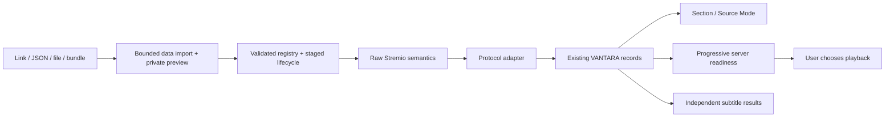

# Addon Fabric rebuild — verification report

Verified on 2026-10-04 UTC. Product version: **0.2.1**. This is an implemented addon library and protocol boundary, not a mockup or a claim that every community addon can play on every runtime.

## Diagnosis

The supplied OpenSubtitles failure had two reproducible causes: the anime filter hid a successful install, and an exact repeated install was treated as replacement whenever a registry snapshot existed. It also reset disabled state and cache identity after the snapshot ended. Actual before-browser evidence is in [UX-AUDIT.md](UX-AUDIT.md). The original phone's particular snapshot owner remains **UNVERIFIED**.

Other actual defects: Stremio external types and VANTARA section types were mixed; string/object resource prefixes behaved differently from the official client; Cinemeta's extra resource could reject its manifest; catalog extras/configuration were incomplete; provider install/cache hits could be confused with functional health; Source Mode lacked required catalog controls. Native provider projection used only the first subtitle resource. The initial-source audits are preserved in [STREMIO-RESEARCH.md](STREMIO-RESEARCH.md) and [NATIVE-BOUNDARY-AUDIT.md](NATIVE-BOUNDARY-AUDIT.md).

## What changed

- Responsive Arabic library/Explore cards, public logo or fallback, ordinary descriptions, content/language chips, explicit actions and honest status. The sidebar puzzle entry stays fixed across sections. Technical diagnostics are collapsed in details.
- Link, pasted JSON, one/multiple `.json` files, arrays, `addons`/`manifests` bundles, and sectioned `streamAddons`/`subtitleAddons` test packs share selectable previews. Invalid entries remain visible. A setup-page URL is never silently substituted for a missing service endpoint. Bounds: 1 MB import, 100 entries/files, 256 KB per manifest, depth/node limits.
- Private cloned previews are revalidated on install. Exact endpoint/raw-data repeats are no-ops even during a session and preserve the entire row. Real replacements retain the session guard. Queued writes and persistence rollback protect installs, updates, pins and enable/disable.
- Raw external semantics → `stremio-model.js` → adapter → current VANTARA contracts. Safe external types survive without being forced into cinema. Exact catalogs, object/string prefix rules, legacy and modern extras, configured paths/queries, response errors and mixed valid/invalid results have permanent tests.
- Source Mode has catalog tabs, supported required filters, search, pagination and retry/cancel handling. Compatible works open through the existing section/work/episode flow. Metadata-only providers never invent a server; subtitle-only providers never join stream fan-out.
- Configuration, empty responses, unsupported formats and failures are separate. Candidate means incomplete evidence; Stable requires recent current-version/cache-epoch functional evidence for every supported capability; Broken requires an actual failing capability. Installing a manifest is not a health certificate. Manual diagnostics bypass cache and report untested resources honestly when no matching sample identity exists.
- Update preview, permission/host review, activation after sessions and one-version rollback remain real registry operations. Full configured URLs stay private. External setup opens a separate safe HTTPS tab, with no iframe.
- Subtitle resource projection respects all supported native rules. Stream filename/hash/size hints survive the existing PWA candidate boundary. No Kotlin or Media3 change; no subtitle/editor/player redesign, no source engine or THE ROCK change.

The independent diff review found delayed-install cancellation/reveal, stale lifecycle controls, failed pagination retry and legacy required catalog extras. Each was corrected with regression coverage; no critical issue remained in that review. Opening or closing addon UI does not initiate video playback.

## Architecture and scope

Main code groups:

| Files | Purpose |
| --- | --- |
| `addons/stremio-model.js`, `manifest.js`, `adapters/stremio.js` | Official resource/catalog/configuration dispatch and normalized responses |
| `addons/import.js`, `registry.js` | All import formats, preview authority, duplicate and lifecycle safety |
| `addons/assessment.js`, `health.js`, `runtime.js` | Evidence-based states, explicit supported capabilities, real probes |
| `addons/native-runtime.js`, `streams.js`, `subtitles.js`, `video.js` | Necessary subtitle/stream identity and platform boundaries |
| `v35/addons-view.js`, `addons.css`, `source-mode.js` | Scoped responsive hub, management and source browser |
| `v35/shell.js`, `index.html`, `sw.js`, `lib/release.js`, `addons/contracts.js` | Hub wiring, offline closure/digest and update notes/version |
| `pwa/bridges/anime.js` | Only preservation of two existing stream matching fields: `videoHash`, `videoSize` |
| Corresponding tests and `docs/addons/rebuild/research/*` | Persistent regressions, actual observations and provenance |

No account, manga reader, library, social, existing provider, general CSS, Kotlin, Media3, Aniyomi or playback decision changes. No dependency/framework addition. Data only: no `eval`, remote JS execution or provider iframe. No Stremio GPL implementation copied; independent behavior implementation with official MIT SDK/client references. No third-party implementation code reused.

## Verification

| Check | Result / boundary |
| --- | --- |
| Full Vitest suite | **181 files, 1620 tests passed** |
| Repository safety, precache closure/digest | **54 passed** |
| Android `assembleDebug` + `testDebugUnitTest` | **BUILD SUCCESSFUL**, **243 Kotlin tests**, 0 failures/errors |
| Native fingerprint | Unchanged: `2698148680d5dbcf734ae167` |
| Actual Chromium at 390×844 / 1366×768 / 1920×1080 | Hub, URL import, duplicate during held real snapshot, JSON partial bundle, actual file upload, diagnostics and Source Mode; no JavaScript errors |
| Existing section integration | Actual shell + controlled adapter/media fixtures: source → work → episode → Ready; zero video elements before user playback (**NO autoplay**) |
| Cinemeta live browser-origin adapter | Version 3.0.14; actual search returned 6 catalog entries and meta returned IMDb `tt1254207` |
| OpenSubtitles live browser-origin adapter | Version 1.0.0; actual series request returned **97 results / 24 languages**, including Arabic |
| SubDL / SubSource public manifests | Versions 1.2.2 / 1.4.2; both require real configuration; no fake success |
| Public corpus | Six real manifest captures, minimal actual catalog/meta/subtitle/stream/error captures, authored configured-URL/error regressions; provenance and sanitization documented |

Live results: [browser-live-proof.json](research/browser-live-proof.json). Response corpus subtitle URLs are deliberately replaced with inert URLs; corpus tests prove parsing/dispatch, not playback of those rewritten URLs. Public service health can change after the observation.

## Actual screenshots

| Flow | Before | After |
| --- | --- | --- |
| Desktop library | [1366](screenshots/before-desktop.png) | [Explore 1366](screenshots/after-explore-1366.png), [1920](screenshots/after-explore-1920.png), [installed cards](screenshots/after-installed-1366.png) |
| Mobile | [390](screenshots/before-mobile.png) | [Explore](screenshots/after-explore-mobile.png), [installed cards](screenshots/after-installed-mobile.png) |
| Import | [URL preview](screenshots/before-preview-mobile.png), [duplicate error](screenshots/before-duplicate-error.png) | [live URL preview](screenshots/after-live-preview-mobile.png), [partial JSON bundle](screenshots/after-bundle-preview-mobile.png) |
| Details | — | [actual diagnostic UI](screenshots/after-details-mobile.png) |
| Source Mode | — | [Desktop](screenshots/after-source-1366.png), [mobile](screenshots/after-source-mobile.png) |

Screenshots run the actual product shell in an isolated local store. Source/media test cards are labeled test content; they are not represented as live provider playback. No production account state was written.

## Remaining limitations / UNVERIFIED

- **UNVERIFIED:** physical phone APK/PWA E2E, actual Media3 subtitle playback from these services, subtitle release synchronization, and a full third-party stream-to-playing-video E2E. Native compilation and data tests do not replace device proof.
- **UNVERIFIED:** configured API-key/account/subscription services (SubDL/SubSource and others), hash-specific live matching, and setup pages for custom mounted servers. The official SDK `/configure` convention and curated setup links are implemented; arbitrary custom routes cannot be inferred reliably.
- Explore is a curated list of four public services, not the entire Stremio community directory. Unknown safe resources/types remain preserved with explicit capability limits. The added public test pack is an import input, not a certified recommendation list: its claims about providers are not adopted as health evidence.
- One installation per origin + manifest ID remains the registry identity. A different configuration is an explicit replacement with a previous version, rather than simultaneous configurations of the same ID. No broad migration was performed.
- PWA supports compatible direct public HTTPS MP4/HLS records. Torrents, Usenet/archive/YouTube, local streaming servers, custom HTTP-header streams, native-external video providers and DASH through this source path are explicitly unsupported. Successful manifest install does not make them Ready or supply a torrent engine.
- APK external providers remain subtitle-only; current native matching requires confirmed IMDb/episode identity and its existing endpoint rules. Native results do not feed a fabricated Stable badge in JavaScript. Kotlin also bounds provider descriptors; uncommon large multi-rule native lists remain **UNVERIFIED**.
- Generic cross-provider video fan-out requires confirmed IMDb identity. Provider-specific video IDs remain usable within their own compatible adapter; titles alone do not establish identity.
- Existing cinema warm-session retention/cancellation ownership is documented in the boundary audit and deliberately untouched. The exact-repeat fix addresses the duplicate-install symptom without claiming that unrelated lifecycle has been repaired.

The honest compatibility target is: install any bounded compatible data addon, explain configuration and capability limits clearly, and run supported resources naturally. It is not a claim that every addon supplies playable high-quality streams for every work.
